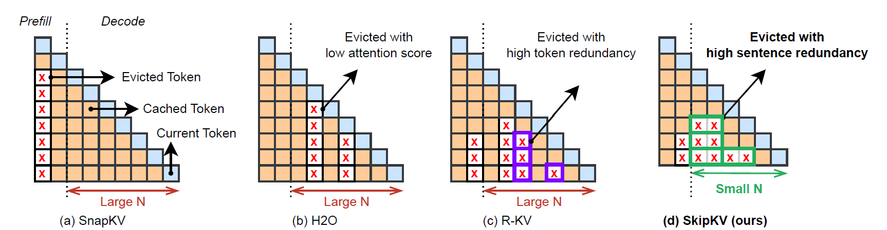
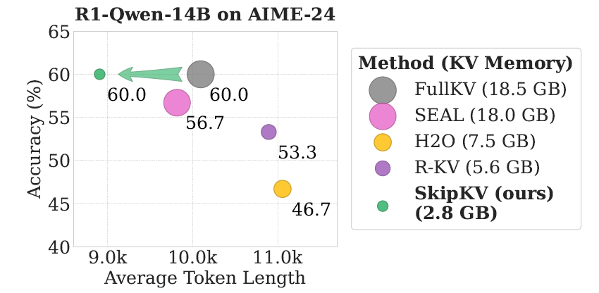
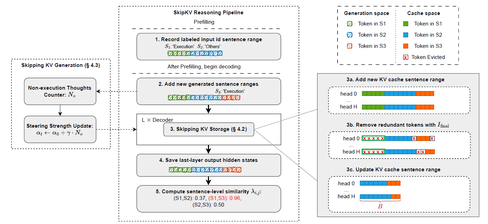
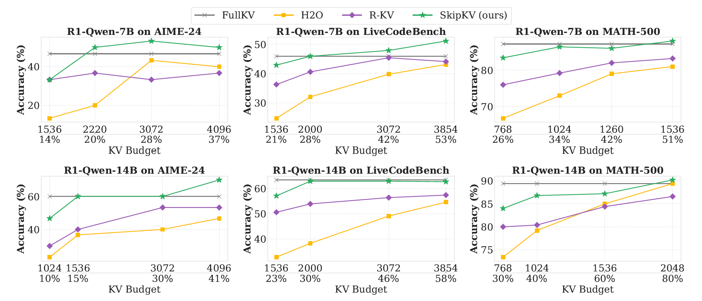
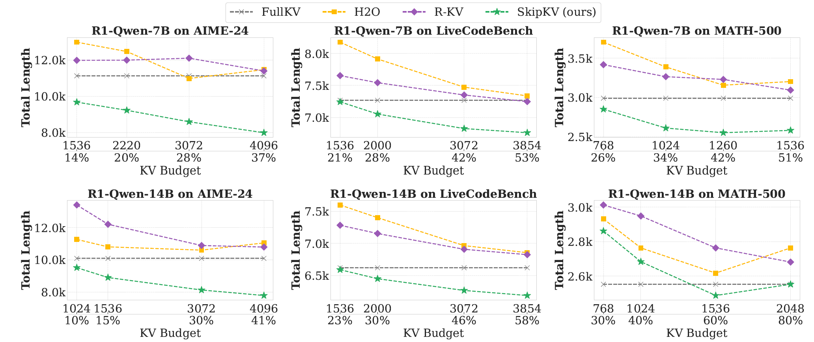
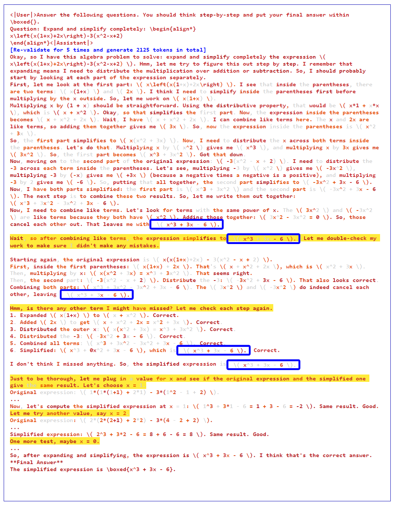
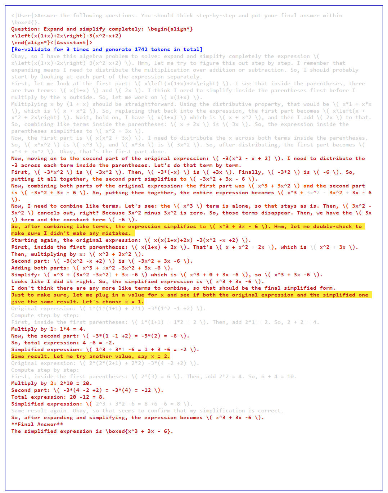

<h1 align="center">SkipKV: Selectively Skip KV Generation and Storage for Efficient Inference with Large Reasoning Models.</h1>


<p align="center">
  <a href="https://arxiv.org/abs/2512.07993">
    
  </a>
  <a href="https://github.com/TTTTTTris/SkipKV">
    
  </a>
</p>

<div align="center">
  
</div>

Unlike previous token eviction methods, SkipKV:
- Maintains high-accuracy, low-memory reasoning in *multi-batch* scenarios,
- Reduces both *kv memory* and *genenration length* for reasoning efficiency.


## 🔥 News
- 📦 **Code will be released soon!**
- 🚀 [25/11/05] We are excited to announce SkipKV, a decoding-time KV-cache compression technique designed for efficient reasoning-model inference.


## ⚙️ Setup

### Install Dependencies
Use the following command to install the minimal required dependencies:
```bash
pip install -r requirements.txt
```

## 🚀 Quick Start
Before running the scripts, you need to build the skipkv package:
```bash
pip install -e .
```

Use the following command to run R1-like models with SkipKV on math benchmarks:
```bash
bash run.sh # gsm8k, math-500, aime24
bash run_code.sh # LiveCodeBench with evaluation
```

To evaluate benchmark results, simply run:
```bash
bash examples/eval.sh # gsm8k, math-500, aime24
```
The results will be saved in the `outputs` directory.

## 📊 Visualization

We implement visualization functions to help illustrate the multi-step token eviction pattern.

Run `analysis_scripts/analysis.ipynb` to see which tokens are kept at each compression step.


## 💡 Motivations
- **Observation 1**: With KV eviction, **reasoning accuracy drops in multi-batch decoding** compared to that with single-batch.
- **Observation 2**: At reduced KV budget the **total generation length often increases** compared to that without any KV compression.
- **Observation 3**: Token-level eviction often causes **fragmented removal of words**, leading the LRM to **overthink**.
- **Observation 4**: Both correct and **incorrect** reasoning responses generate highly similar sentences with the later scenario usually generating **higher % of similar sentences**.
- **Observation 5**: **Incorrect** response generate significantly **higher % of non-execution thoughts** compared to the correct ones.

## 🧠 Overview
**SkipKV** - a training-free KV compression method for selective **eviction** *and* **generation** operating at a **coarse-grained sentence-level sequence removal** for efficient CoT reasoning.
<div align="center">
  
</div>

In multi-batch decoding scenrio:
- **15 % cache → 100 % accuracy**
- **20 % cache → 107 % accuracy**<br>
- **25 % cache → 114 % accuracy**<br>
- **9.6 × throughput** during long CoT generation  
- Consistent wins over all prior token eviction baselines (H2O, R-KV) on MATH-500, AIME-24, LiveCodeBench


## 🔍 SkipKV: Methodology
- **Skip KV Storage**: Sentence Redundancy Driven Cumulative Score.
- **Skip KV Generation**: Sentence-Function-based Dynamic Steering of Latent Representation during Decoding.
- **Mutli-batch Serving**: Exaggerate effective KV Cache Size for KV Eviction via Batch Grouping.
<div align="center">
  
</div>


## 🧪 Experimental Setup

### Models

| Model | Checkpoint |
|----------|------------|
| **R1-Llama-8B**  | `deepseek-ai/DeepSeek-R1-Distill-Llama-8B` |
| **R1-Qwen-7B**  | `deepseek-ai/DeepSeek-R1-Distill-Qwen-7B` |
| **R1-Qwen-14B**  | `deepseek-ai/DeepSeek-R1-Distill-Qwen-14B` |

### Datasets
| Benchmark | Max gen len |
|-----------|-----------:|
| **GSM8K** |  8 192 |
| **MATH-500** | 16 384 |
| **AIME 2024** | 16 384 |
| **LiveCodeBench** | 10 000 |

### Baselines
* **FullKV** – no compression, upper-bound quality.  
* **H2O** – Preious token eviction method for long-context tasks.
* **R-KV** – Recent token eviction method for reasoning tasks; strong single-batch performance but fails under multi-batch decoding.

---

## 📈 Results (Pass@1) 

### Main Accuracy Curves
<div align="center">
  
</div>

| Model | Dataset | **Lossless @ Ratio** | **Lossless @ Fixed tokens** |
|-------|---------|---------------------:|----------------------------:|
| R1-Qwen-7B | LiveCodeBench | 28 % | 2 000 |
| R1-Qwen-7B | AIME-24 | 20 % | 2 000 |
| R1-Qwen-14B | LiveCodeBench | 15 % | 2 000 |
| R1-Qwen-14B | AIME-24 | 15 % | 1 536 |


### 🧮 Generation Length Curves

<div align="center">
  
</div>

| Model | Dataset | **Max Reduced Generation Length** |
|-------|---------|---------------------:|
| R1-Qwen-7B | MATH-500 | 15% |
| R1-Qwen-7B | AIME-24 | 28% |
| R1-Qwen-7B | LiveCodeBench | 7% |

## 🔍 SkipKV vs R-KV: Token-Selection Comparison

> The figure below shows which tokens are picked by **R-KV** (left) and the pure-attention baseline **SkipKV** (right).  
> **Grey** = not selected &nbsp;|&nbsp; **Light orange → Dark red** = selected tokens (deeper red = chosen by more attention heads)

<div align="center">
  
  
</div>

### Key Findings:
- **Reduced Overthinking**: In the selected example, both methods produce the correct final answer; however, **SkipKV  (3 revalidations)** generates approximately **20% fewer tokens** than **R-KV (5 revalidations)**.
- **More Consistent Reasoning Path**: - R-KV’s redundancy-based scoring often removes **critical numerical tokens**, disrupting logical coherence and prolonging generation. In contrast, SkipKV’s **sentence-level, semantics-aware** eviction preserves essential reasoning steps, maintaining a more consistent and concise reasoning trajectory.

# 🙏 Citation & Acknowledgement
@article{tian2025skipkv,
  title={SkipKV: Selective Skipping of KV Generation and Storage for Efficient Inference with Large Reasoning Models},
  author={Tian, Jiayi and Azizi, Seyedarmin and Zhao, Yequan and Potraghloo, Erfan Baghaei and McPherson, Sean and Sridhar, Sharath Nittur and Wang, Zhengyang and Zhang, Zheng and Pedram, Massoud and Kundu, Souvik},
  journal={arXiv preprint arXiv:2512.07993},
  year={2025}
}
Our release code is developed based on [R-KV](https://github.com/Zefan-Cai/R-KV/tree/main) and [SEAL](https://github.com/VITA-Group/SEAL). 

